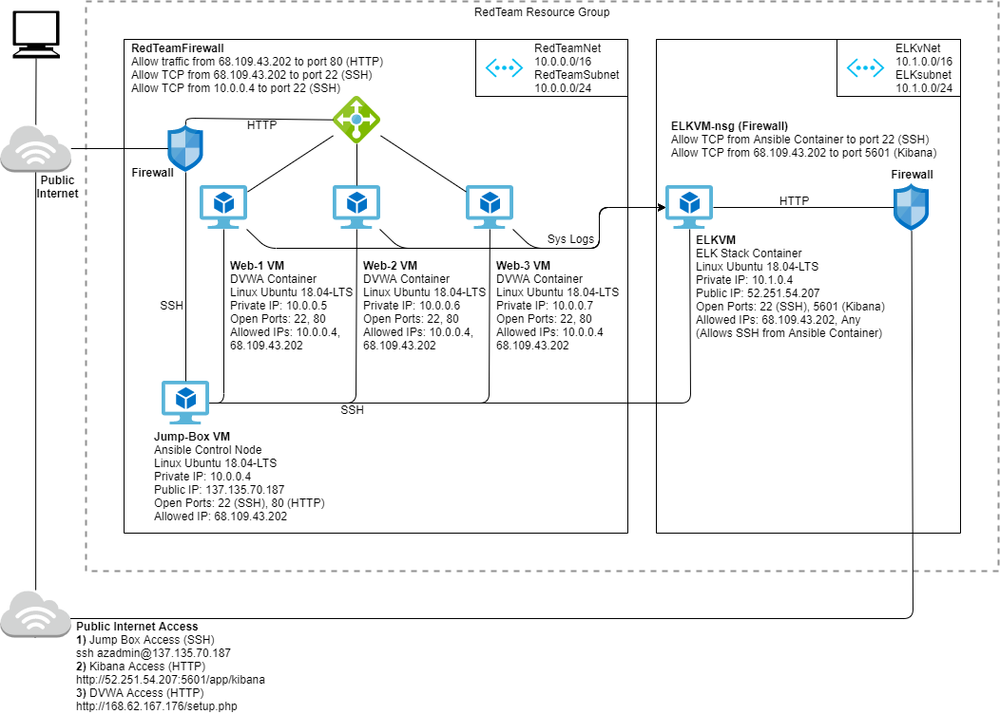
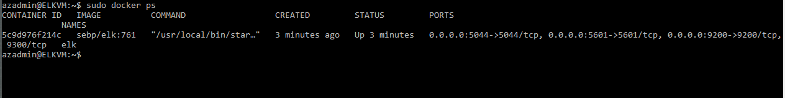

## Automated ELK Stack Deployment

The files in this repository were used to configure the network depicted below.

These files have been tested and used to generate a live ELK deployment on Azure. They can be used to recreate the entire deployment pictured above. Alternatively, select portions of the Ansible files may be used to install only certain pieces, such as Filebeat.

  - Cyber_Security/Ansible/dvwa.yml
  - Cyber_Security/Ansible/install-elk.yml
  - [install-elk.yml](https://github.com/patricknakayama/Cyber_Security/blob/45e26950f911757432047050eecc93209479bc19/Ansible/install-elk.yml)
  - Cyber_Security/Ansible/filebeat-playbook.yml
  - Cyber_Security/Ansible/filebeat-config.yml
  - Cyber_Security/Ansible/metricbeat-playbook.yml
  - Cyber_Security/Ansible/metricbeat-config.yml

This document contains the following details:
- Description of the Topology
- Access Policies
- ELK Configuration
  - Beats in Use
  - Machines Being Monitored
- How to Use the Ansible Build

### Description of the Topology

The main purpose of this network is to expose a load-balanced and monitored instance of DVWA, the D*mn Vulnerable Web Application.

Load balancing ensures that the application will be highly resilient, while the implementaion of a Jump Box provides the benefit of restricting network access to a single machine.
- Load balancers protect the availability of the network by ensuring redundancy in case one of the machines goes down.
- Jump boxes restrict network access by creating an intermediary machine that serves as a gateway which only allows specific IP addresses into the internal network.

Integrating an ELK server allows users to easily monitor the vulnerable VMs for changes to the files and system metrics.
- Filebeat watches for file system changes and collects log data.
- Metricbeat records machine metric data which provides a picture of how healthy each device is.

The configuration details of each machine may be found below.

| Name     | Function | Private IP Address | Public IP Address | Operating System |
|----------|----------|--------------------|-------------------|------------------|
| Jump-Box | Gateway  | 10.0.0.4           | 137.135.70.187    | Linux            |
| Web-1    | DVWA     | 10.0.0.5           | -                 | Linux            |
| Web-2    | DVWA     | 10.0.0.6           | -                 | Linux            |
| Web-3    | DVWA     | 10.0.0.7           | -                 | Linux            |
| ELKVM    | ELK      | 10.1.0.4           | 52.251.54.207     | Linux            |

### Access Policies

The machines on the internal network are not exposed to the public Internet. 

Only the Gateway machine can accept connections from the Internet. Access to this machine is only allowed from the following IP address:
- 68.109.43.202

Machines within the network can only be accessed by the Jump Box, which has the following IP Address:
- Jump-Box IP 10.0.0.4

A summary of the access policies in place can be found in the table below.

| Name     | Publicy Accessible | Allowed IP Addresses                                   |
|----------|--------------------|--------------------------------------------------------|
| Jump-Box | Yes                | 68.109.43.202                                          |
| Web-1    | No                 | 10.0.0.4, 68.109.43.202                                |
| Web-2    | No                 | 10.0.0.4, 68.109.43.202                                |
| Web-3    | No                 | 10.0.0.4, 68.109.43.202                                |
| ELKVM    | No                 | 68.109.43.202, Any (Allows SSH from Ansible Container) |

### Elk Configuration

Ansible was used to automate configuration of the ELK machine. No configuration was performed manually, which is advantageous for several reasons:
- Reduces the possibility of human error in the configuration process.
- Code configurations are stored in text files which can be changed and deployed quickly.
- Allows infrastructure to be deployed quickly and repetitively across multiple machines.

The playbook implements the following tasks:
- Install docker.io (Docker engine), python3-pip (package used to install Python), and docker module (Python client for Docker).
- Increase virtual memory on ELK machine.
- Download the Docker container sebp/elk:761
- Configure container to start with the following port mappings: 5601:5601 | 9200:9200 | 5044:5044
- Start the Docker container.
- Enable docker service on boot.

The following screenshot displays the result of running `docker ps` after successfully configuring the ELK instance.

### Target Machines & Beats
This ELK server is configured to monitor the following machines:
- 10.0.0.5
- 10.0.0.6
- 10.0.0.7

We have installed the following Beats on these machines:
- Filebeat
- Metricbeat

These Beats allow us to collect the following information from each machine:
- Filebeat collects, parses, and visualizes ELK log data. The aggregated log data provides information such as which files have been changed and when. Once it has been installed on DVWA, we will be able to see system logs, Sudo commands, and SSH logins. We can also view specific log details in table or JSON format for detailed analysis.
- Metricbeat collects metric data from Docker containers. Once it has been installed on DVWA, we will see the container's CPU usage, DiskIO, Memory usage, Network IO, and healthcheck status.

### Using the Playbook
In order to use the playbook, you will need to have an Ansible control node already configured. Assuming you have such a control node provisioned: 

SSH into the control node and follow the steps below:
- Copy the following files to your Ansible container:
  - Copy the install-elk.yml file to `/etc/ansible/install-elk.yml`
  - Copy the filebeat-playbook.yml file to `/etc/ansible/roles/filebeat-playbook.yml`
  - Copy the filebeat-config.yml file to `/etc/ansible/filebeat-config.yml`
    - Alternatively, you can also use the following curl command: `curl https://gist.githubusercontent.com/slape/5cc350109583af6cbe577bbcc0710c93/raw/eca603b72586fbe148c11f9c87bf96a63cb25760/Filebeat >> /etc/ansible/filebeat-config.yml`
  - Copy the metricbeat-playbook.yml file to `/etc/ansible/roles/metricbeat-playbook.yml`
  - Copy the metricbeat-config.yml file to `/etc/ansible/metricbeat-config.yml`
    - Alternatively, you can also use the following curl command: `curl https://gist.githubusercontent.com/slape/58541585cc1886d2e26cd8be557ce04c/raw/0ce2c7e744c54513616966affb5e9d96f5e12f73/metricbeat >> /etc/ansible/metricbeat-config.yml`
- Update the following files to include your unique IP addresses and username:
  - Update the Ansible Hosts file to include the IP addresses of the machines where the ELK server, Filebeat, and Metricbeat will be installed:
    - Use the following command: `nano /etc/ansible/hosts`
    - The machines listed under `[webservers]` are the monitored devices that Filebeat and Metricbeat will be installed on.
    - The machine listed under `[elk]` is the ELK server that the install-elk.yml playbook will run on.
    - To avoid conflicts with the python interpreter version, ensure that each IP address is followed by the line: `ansible_python_interpreter=/usr/bin/python3`
  - Update the Ansible Config file and set the remote_user value to your username:
    - Use the following command: `nano /etc/ansible/ansible.cfg`
  - Update the install-elk.yml file and set the remote_user value to your username:
    - Use the following command: `nano /etc/ansible/install-elk.yml`
  - Update the filebeat-config.yml file and set the host values to your ELK machine's IP address:
    - Use the following command: `nano /etc/ansible/filebeat-config.yml`
    - Scroll to line #1105 under the Output section and update the host IP address.
    - Scroll to line #1805 under the Kibana section and update the host IP address.
  - Update the metricbeat-config.yml file and set the host values to your ELK machine's IP address:
    - Use the following command: `nano /etc/ansible/metricbeat-config.yml`
    - Scroll to line #62 under the Kibana section and update the host IP address.
    - Scroll to line #96 under the Output section and update the host IP address.
- Run the playbook, and navigate to `http://[YOUR_ELK_SERVER_PUBLIC_IP]:5601/app/kibana` to check that the installation worked as expected.
  - From the ELK server GUI you can also verify that Filebeat and Metricbeat are receiving data.
  - Filebeat Verification:
    - Click Add Log Data.
    - Click System Logs.
    - Scroll to the bottom of the page and click on Check data.
    - You should see the message: Data successfully received from this module
    - Click on System logs dashboard to view the data.
  - Metricbeat Verification:
    - Click Add Metric Data.
    - Click Docker Metrics.
    - Scroll to the bottom of the page and click on Check data.
    - You should see the message: Data successfully received from this module
    - Click on Docker metrics dashboard to view the data

### Updating Filebeat and Metricbeat Playbooks

To ensure that the playbooks are using the most up to date installation instructions, follow the steps below:
- Updating Filebeat
  - Navigate to your ELK server GUI: `http://[YOUR_ELK_SERVER_PUBLIC_IP]:5601/app/kibana`
  - Click Add Log Data.
  - Click System Logs.
  - Click on the DEB tab under Getting Started.
  - Here you will see the most recent instructions to download, install, configure, and start Filebeat.
  - Update your filebeat-playbook.yml file in Ansible accordingly.
- Updating Metricbeat
  - Navigate to your ELK server GUI: `http://[YOUR_ELK_SERVER_PUBLIC_IP]:5601/app/kibana`
  - Click Add Metric Data.
  - Click Docker Metrics.
  - Click the DEB tab under Getting Started.
  - Here you will see the most recent instructions to download, install, configure, and start Metricbeat.
  - Update your filebeat-playbook.yml file in Ansible accordingly.
