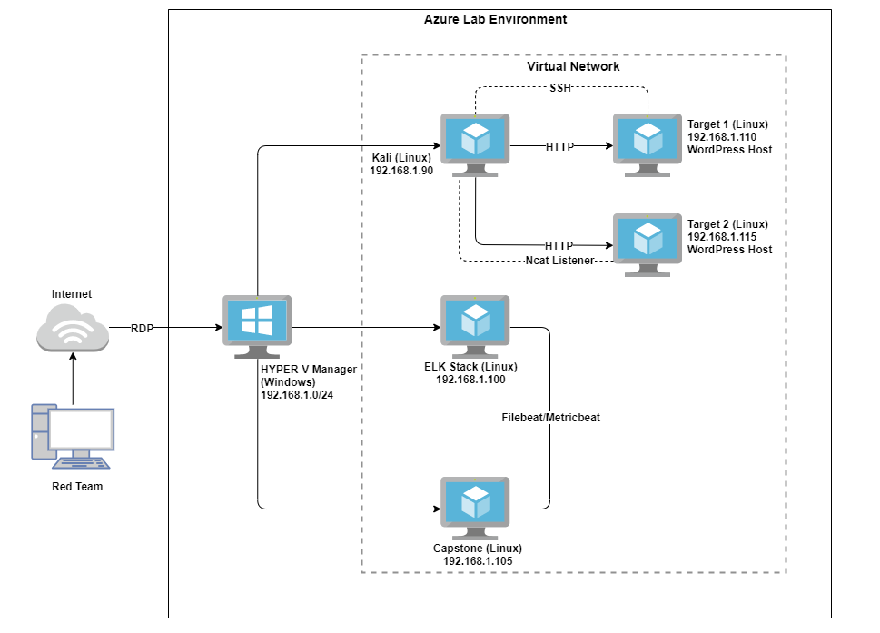
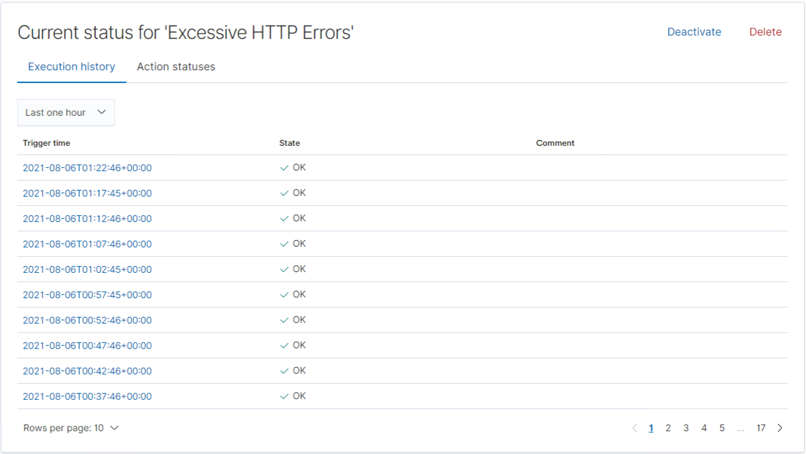
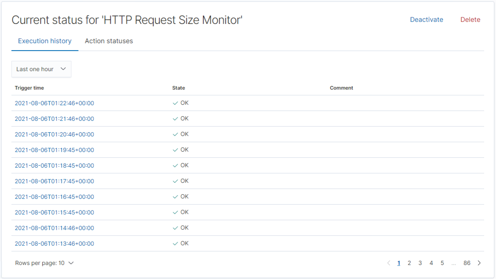
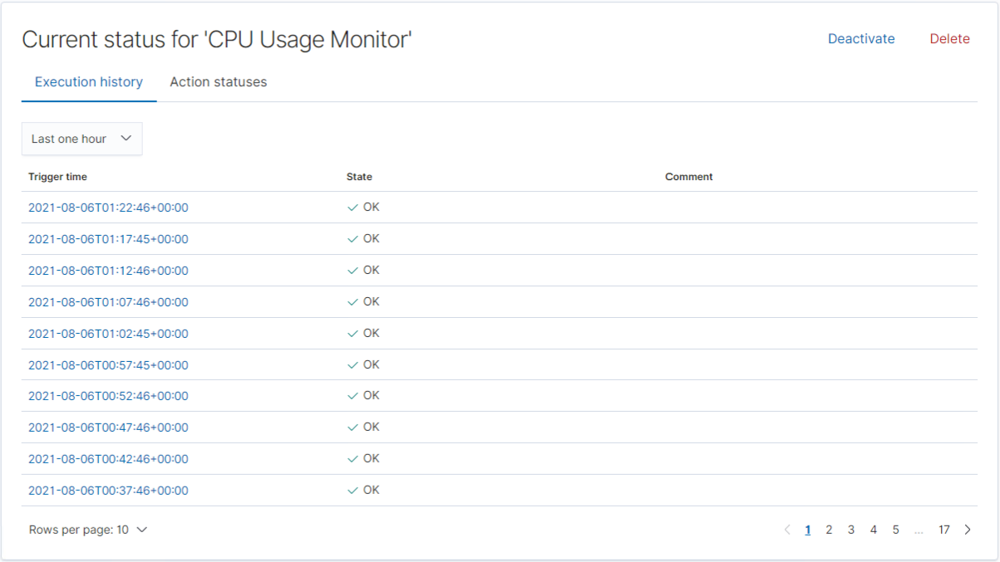

# Blue Team: Summary of Operations

## Table of Contents
- Network Topology
- Description of Targets
- Monitoring the Targets
- Patterns of Traffic & Behavior
- Suggestions for Going Further

### Network Topology

The following machines were identified on the network:
- HYPER-V Manager
  - **Operating System**: Windows 10
  - **Purpose**: Azure Hyper-V Machine hosting Virtual Network
  - **IP Address**: 192.168.1.0/24
- Kali Linux
  - **Operating System**: Debian Kali 5.4.0
  - **Purpose**: Red Team Penetration Testing Machine
  - **IP Address**: 192.168.1.90
- ELK Stack
  - **Operating System**: Ubuntu 18.04
  - **Purpose**: ELK Stack (Elasticsearch and Kibana)
  - **IP Address**: 192.168.1.100
- Capstone
  - **Operating System**: Ubuntu 18.04
  - **Purpose**: Vulnerable Web Server
  - **IP Address**: 192.168.1.105
- Target 1
  - **Operating System**: Debian GNU/Linux 8
  - **Purpose**: WordPress Host
  - **IP Address**: 192.168.1.110
- Target 2
  - **Operating System**: Debian GNU/Linux 8
  - **Purpose**: WordPress Host
  - **IP Address**: 192.168.1.115

### Description of Targets

The target of this attack was: `Target 1` (192.168.1.110).

Target 1 is an Apache web server and has SSH enabled, so ports 80 and 22 are possible ports of entry for attackers. As such, the following alerts have been implemented.

### Monitoring the Targets

Traffic to these services should be carefully monitored. To this end, we have implemented the alerts below:

#### **Alert 1: Excessive HTTP Errors**
`WHEN count() GROUPED OVER top 5 'http.response.status_code' IS ABOVE 400 FOR THE LAST 5 minutes`

Alert 1 is implemented as follows:
  - **Metric**: Count grouped over top 5 ‘http.response.status_code’
  - **Threshold**: Above 400 in 5-minute period
  - **Vulnerability Mitigated**: Enumeration/Brute Force
  - **Reliability**: This alert is highly reliable. Measuring by error codes 400 and above will filter out any normal or successful responses. 400+ codes are client and server errors which are of more concern.

#### **Alert 2: HTTP Request Size Monitor**
`WHEN sum() of http.request.bytes OVER all documents IS ABOVE 3500 FOR THE LAST 1 minute`
Alert 2 is implemented as follows:
  - **Metric**: Sum of http.request.bytes over all documents
  - **Threshold**: Above 3500 in 1-minute period
  - **Vulnerability Mitigated**: Code injection in HTTP requests (XSS and CRLF) or DDOS
  - **Reliability**: Alert could create false positives. It comes in at a medium reliability. There is a possibility for a large non malicious HTTP request or legitimate HTTP traffic.

#### **Alert 3: CPU Usage Monitor**
`WHEN max() OF system.process.cpu.total.pct OVER all documents IS ABOVE 0.5 FOR THE LAST 5 minutes`
Alert 3 is implemented as follows:
  - **Metric**: Max of system.process.cpu.total.pct over all documents
  - **Threshold**: Above 0.5 in 5-minute period
  - **Vulnerability Mitigated**: Malicious software, programs (malware or viruses) running taking up resources
  - **Reliability**: The alert is highly reliable. Even if there isn’t a malicious program running this can still help determine where to improve on CPU usage.

### Suggestions for Going Further (Optional)
- Each alert above pertains to a specific vulnerability/exploit. Recall that alerts only detect malicious behavior, but do not stop it. For each vulnerability/exploit identified by the alerts above, suggest a patch. E.g., implementing a blocklist is an effective tactic against brute-force attacks. It is not necessary to explain _how_ to implement each patch.

The logs and alerts generated during the assessment suggest that this network is susceptible to several active threats, identified by the alerts above. In addition to watching for occurrences of such threats, the network should be hardened against them. The Blue Team suggests that IT implement the fixes below to protect the network:

- Excessive HTTP Errors Monitor Vulnerability: Enumeration/Brute Force
  - **Patch**: WordPress Hardening
    - Disable the WordPress REST API and XML-RPC if it’s not needed. 
    - You can also configure the web server to block requests to /?author=<number>.
    - Prohibit exposure of /wp-admin and /wp-login.php.

  - **Why It Works**: TODO: E.g., _`special-security-package` scans the system for viruses every day_
    - WPScan uses REST API to enumerate users.
    - XML-RPC uses HTTP as it’s transport mechanism for data.
    - WordPress permalinks can be set to include an author (user) and not exposing WordPress logins adds to brute force attack defense.

- HTTP Request Size Monitor Vulnerability: Code injection in HTTP requests (XSS and CRLF) or DDOS
  - **Patch**: Code Injection/DDOS Hardening
    - Implementation of HTTP Request Limit on the web server
    - Implementation of input validation on forms

  - **Why It Works**: TODO: E.g., _`special-security-package` scans the system for viruses every day_
    - If an HTTP request URL length, query string and over size limit of the request a 404 range of errors will occur.
    - Input validation can help protect against malicious data anyone attempts to send to the server via the website or application in/across a HTTP request.

- CPU Usage Monitor Vulnerability: Malicious software, programs (malware or viruses) running taking up resources
  - **Patch**: Malware Hardening
    - Implement Antivirus software
    - Implement and configure Host Based Intrusion Detection System (HIDS)

  - **Why It Works**: TODO: E.g., _`special-security-package` scans the system for viruses every day_
    - HIDS monitors and analyzes internals of computing systems.

---