# Network Forensic Analysis Report

_TODO_ Complete this report as you complete the Network Activity on Day 3 of class.

## Time Thieves 
You must inspect your traffic capture to answer the following questions:

1. What is the domain name of the users' custom site?
    - Frank-n-Ted-DC.frank-n-ted.com
    - Wireshark Filter: `ip.addr == 10.6.12.0/24`

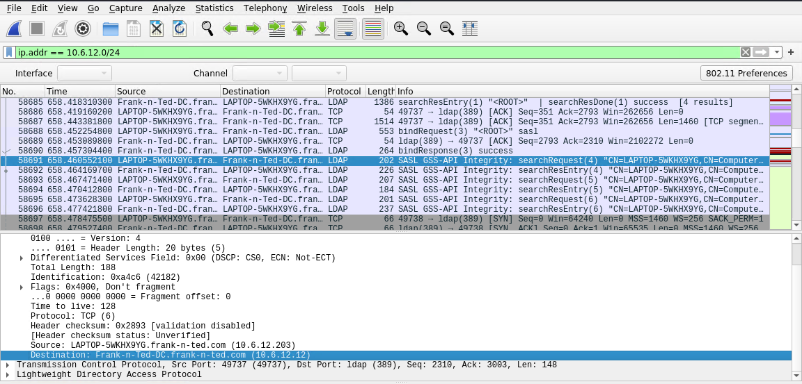

2. What is the IP address of the Domain Controller (DC) of the AD network?
    - 10.6.12.12
    - Wireshark Filter: `ip.addr == 10.6.12.0/24`

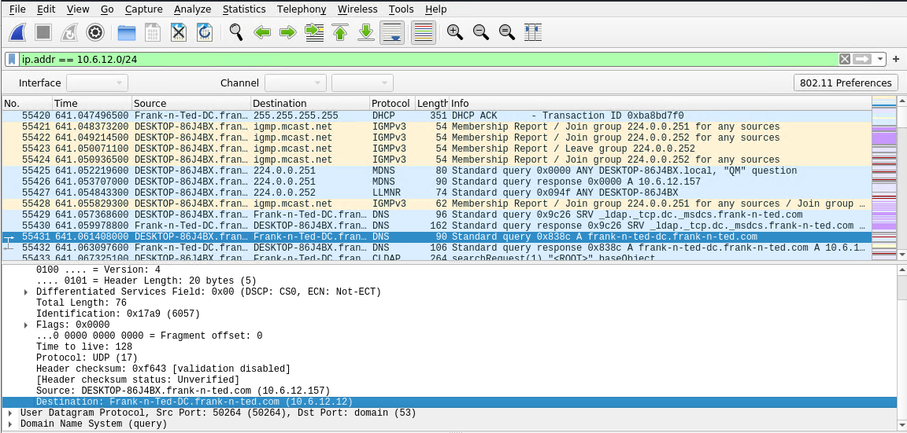

3. What is the name of the malware downloaded to the 10.6.12.203 machine?
    - june11.dll
    - Wireshark Filter: `ip.addr==10.16.12.203 and http.request.method==GET`

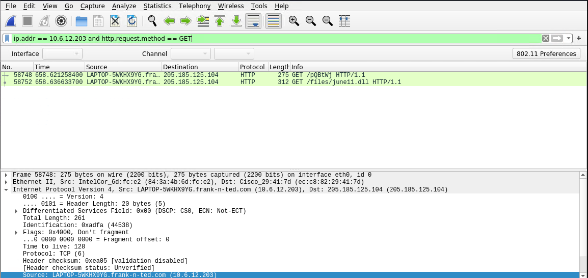

4. Upload the file to [VirusTotal.com](https://www.virustotal.com/gui/). 
    - Exporting file to Kali:
        - Open File Tab
        - Export Objects
        - Select HTTP
        - Add text filter ".dll"
        - Save june11.dll
        - Upload to virustotal

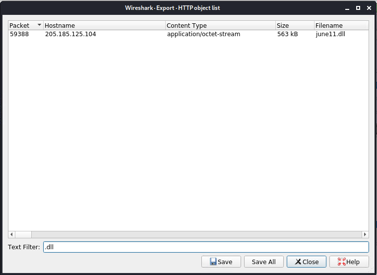

5. What kind of malware is this classified as?
    - trojan

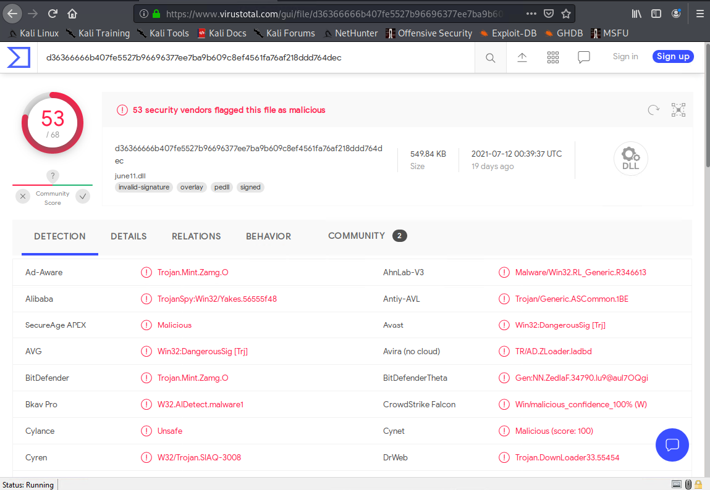

---

## Vulnerable Windows Machine

1. Find the following information about the infected Windows machine:
    - Host name: Rotterdam-PC
    - IP address: 172.16.4.205
    - MAC address: 00:59:07:b0:63:a4
    - Wireshark Filter: `ip.addr == 172.16.4.0/24`

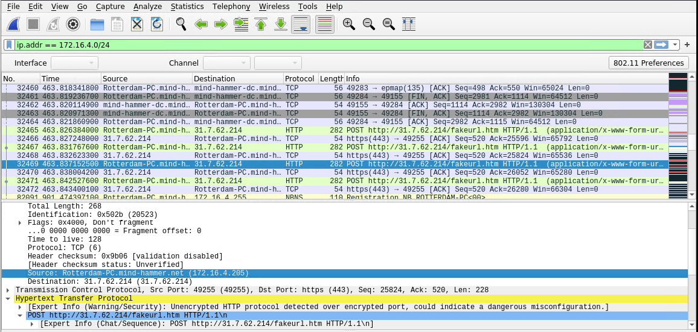
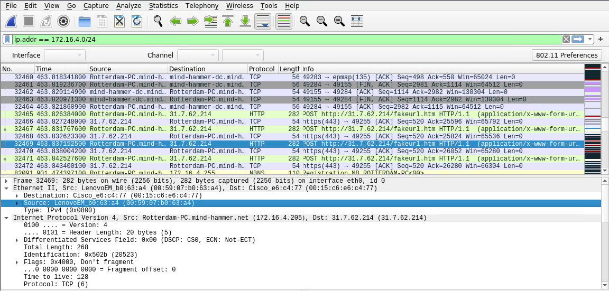

2. What is the username of the Windows user whose computer is infected?
    - matthijs.devries
    - Wireshark Filter: `ip.src == 172.16.4.205 && kerberos.CNameString`

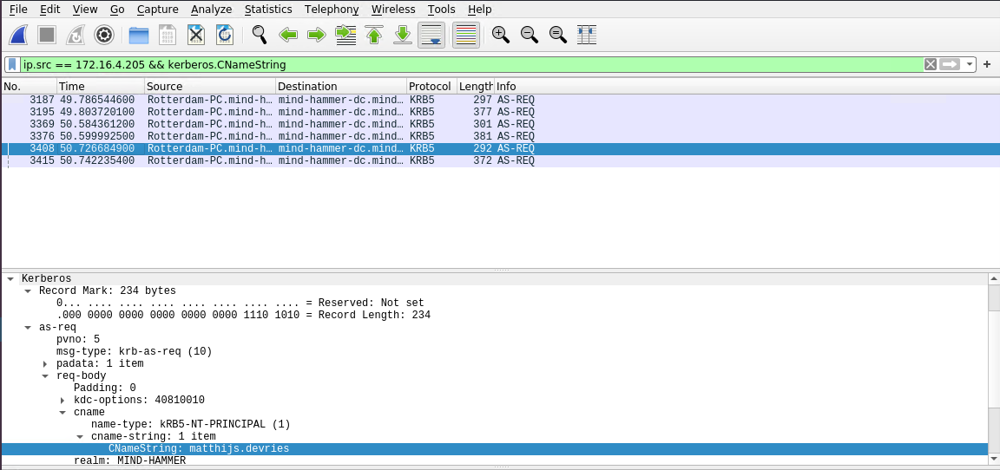

3. What are the IP addresses used in the actual infection traffic?
    - 172.16.4.205 | 185.243.115.84 | 166.62.11.64
    - Open Statistics Tab
    - Click Conversations
    - Select IPv4
    - Sort Packets high to low

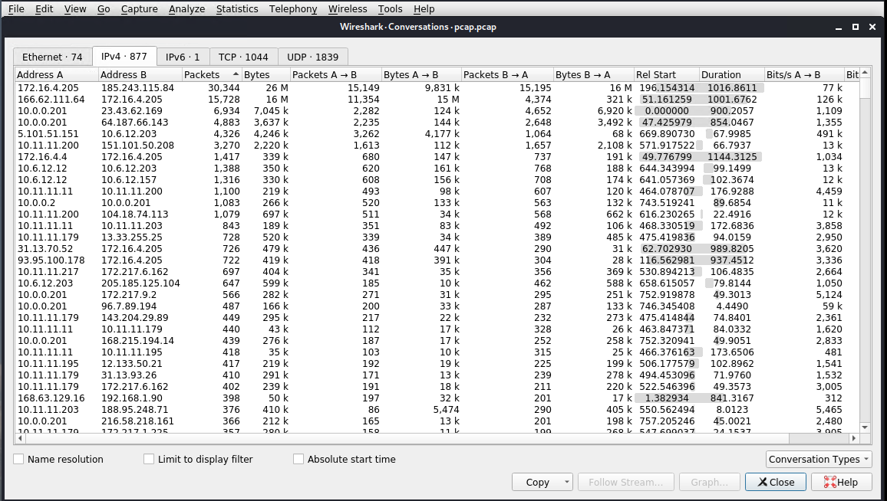
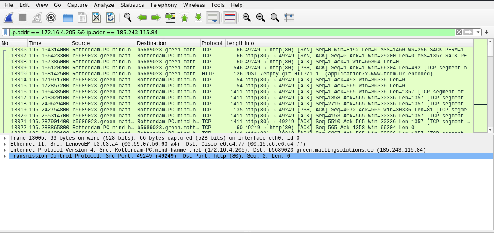

4. As a bonus, retrieve the desktop background of the Windows host.

---

## Illegal Downloads

1. Find the following information about the machine with IP address `10.0.0.201`:
    - MAC address: 00:16:17:18:66:c8
    - Windows username: elmer.blanco
    - OS version: Windows NT 10.0, x64
- Wireshark Filter for MAC: `ip.addr == 10.0.0.201 && dhcp`

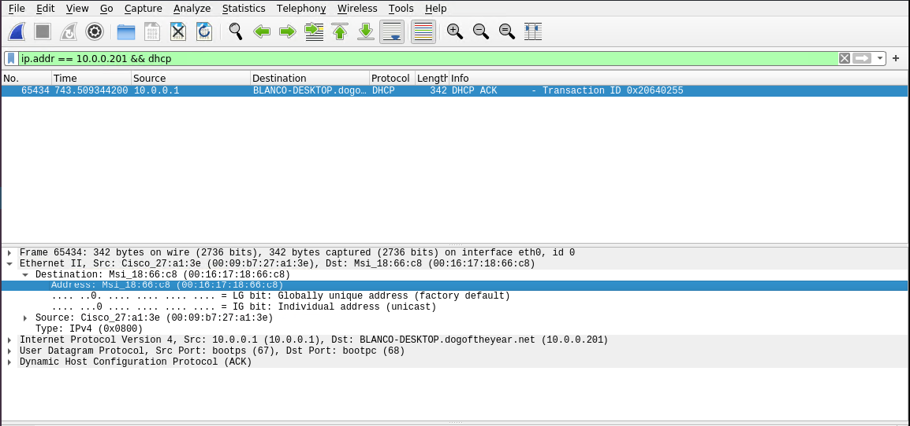

- Wireshark Filter for Username: `ip.src == 10.0.0.201 && kerberos.CNameString`

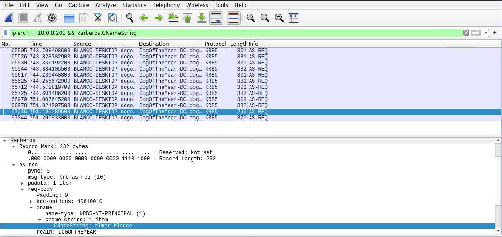

- Wireshark Filter for OS: `ip.addr == 10.0.0.201 && http.request`

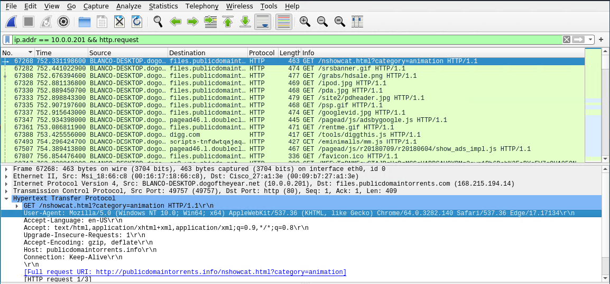

2. Which torrent file did the user download?
    - Betty_Boop_Rhythm_on_the_Reservation.avi.torrent
    - Wireshark Filter: `ip.addr == 10.0.0.201 && http.request.method == "GET"`
    - Sort by Destination files.publicdomaintorrents.com (168.215.194.14)
    - Look for Download request

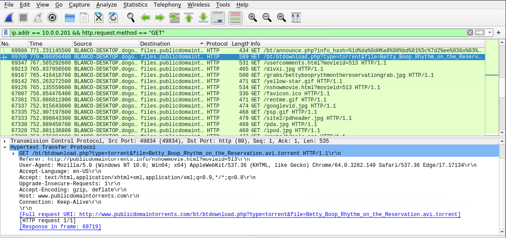
